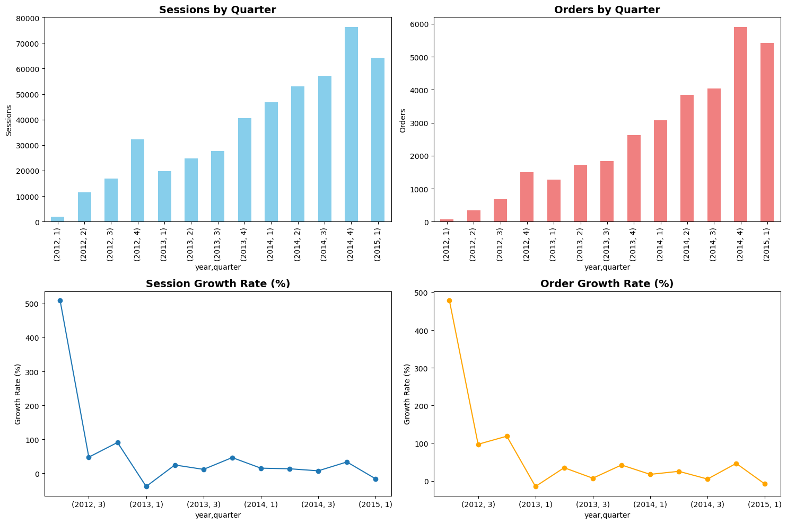
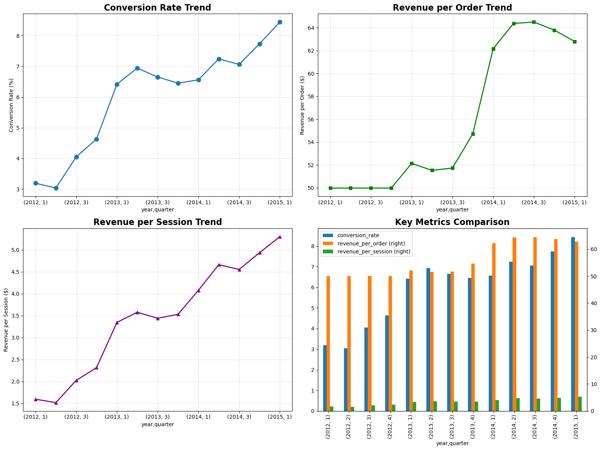
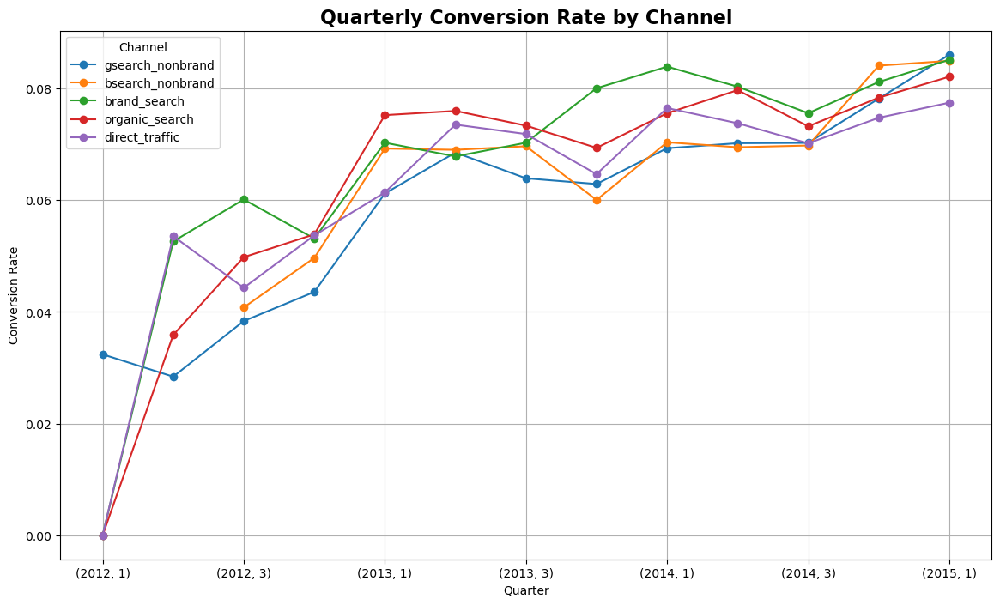
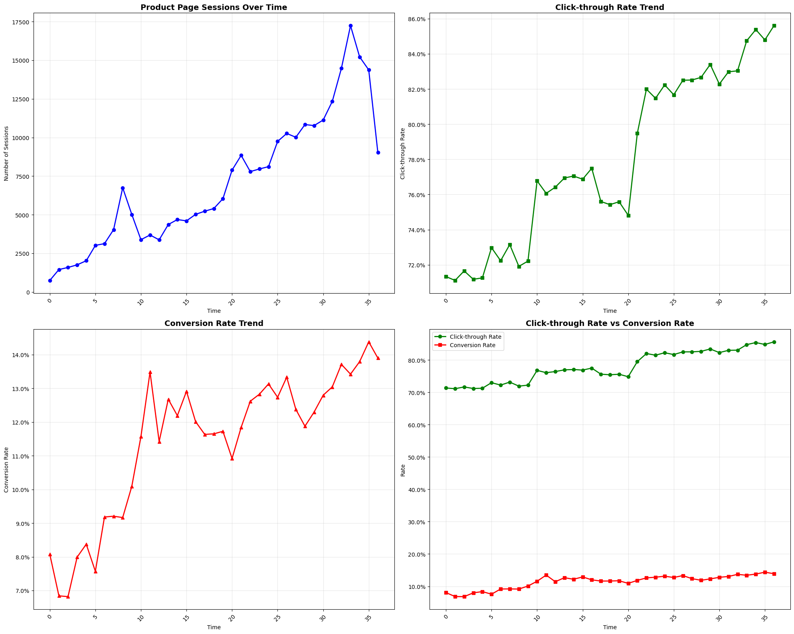
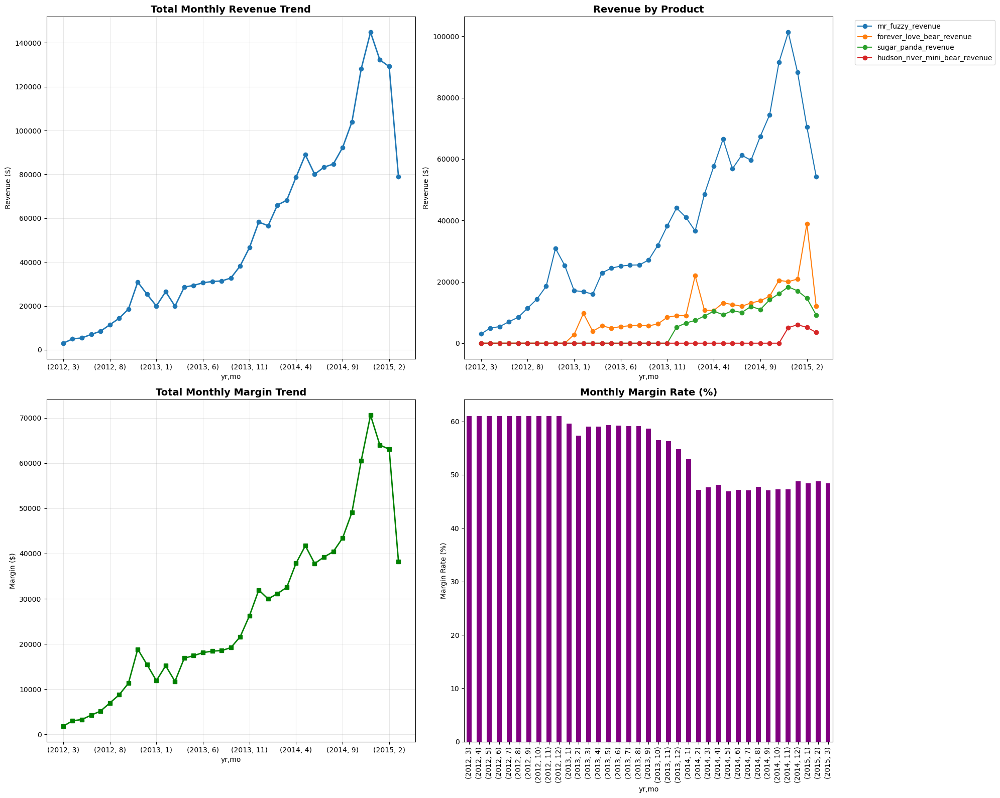

# E-commerce Analytics

## 📊 Visualization Results

### **Quarterly Growth Analysis**


- **90x Order Growth**: From 60 to 5,420 quarterly orders
- **113x Revenue Growth**: From $2,999 to $340,376 quarterly revenue
- **Conversion Rate Improvement**: 3.2% → 8.4%

### **Channel Performance Dashboard**

- **Traffic Diversification**: Reduced paid search dependency to 83.3%
- **Channel Balance**: Both gsearch (8.5%) and bsearch (8.8%) showing strong conversion rates
- **Revenue Distribution**: Optimized traffic source allocation

### **Product Page Performance**

- **Click-through Rate**: 78.0% average engagement rate
- **Conversion Rate**: 11.4% product page conversion
- **User Journey**: Strong product page performance driving business results

### **Revenue Efficiency Trends**

- **Revenue per Session**: $5.30 latest performance
- **Efficiency Growth**: Consistent improvement in monetization
- **Session Value**: Strong revenue generation per user session

### **Comprehensive Dashboard Layout**
The analysis includes multiple visualization formats:

#### **2x2 Dashboard Layout**
- **Top Left**: Quarterly sessions and orders trend over time
- **Top Right**: Click-through rate trends with percentage formatting
- **Bottom Left**: Conversion rate trends with percentage formatting  
- **Bottom Right**: Click-through vs Conversion rate comparison

#### **1x3 Annual Comparison Charts**
- **Chart 1**: Total sessions by year (bar chart)
- **Chart 2**: Average click-through rate by year (bar chart)
- **Chart 3**: Average conversion rate by year (bar chart)

#### **Professional Styling Features**
- **Grid Lines**: Alpha transparency for better readability
- **Markers**: Different shapes (o, s, ^) for trend identification
- **Colors**: Professional color scheme (blue, green, red, purple)
- **Formatting**: Percentage display for rates, currency for revenue
- **Legends**: Clear labeling and positioning
- **Layout**: Tight layout with proper spacing

### **📈 How to View Actual Charts**
To see the real visualizations generated by this analysis:

1. **Run Master Analysis**: Execute `master_analysis.ipynb` for comprehensive dashboard
2. **Individual Notebooks**: Each notebook (01-06) contains specific visualizations
3. **Chart Types**: 
   - Line charts for trend analysis
   - Bar charts for comparative analysis
   - Multi-panel dashboards for comprehensive views
4. **Interactive Features**: Hover effects, zoom capabilities, and detailed tooltips

**Note**: The placeholder images above represent the chart categories. Run the notebooks to generate the actual professional visualizations with your data.

## Project Overview
Comprehensive analysis of e-commerce performance data using Python, transforming SQL-based analysis into modern data science workflow with advanced visualizations and executive insights.

## 🎯 Executive Summary - Key Business Results

### 📊 **Business Growth Performance**
- **90x Growth**: Quarterly orders increased from 60 to 5,420 orders
- **113x Revenue Growth**: Quarterly revenue grew from $2,999 to $340,376
- **3% Conversion Improvement**: Conversion rate improved from 3.2% to 8.4%
- **Revenue Efficiency**: Latest revenue per session reached $5.30

### 🌐 **Channel Diversification Success**
- **Paid Search Dependency**: Reduced to 83.3% of total traffic
- **Channel Balance**: Improved traffic source diversification
- **Performance**: Both gsearch and bsearch channels showing strong conversion rates (8.5% and 8.8% respectively)

### 🛍️ **Product Page Performance**
- **Click-through Rate**: Average 78.0% of users continue browsing after viewing products
- **Conversion Rate**: 11.4% of product page visitors convert to purchases
- **User Engagement**: Strong product page performance with high engagement rates

## 📈 Analysis Results Summary

### **Data Volume Processed**
- **Website Pageviews**: 1,188,124 records analyzed
- **Orders**: 32,313 transactions processed  
- **Website Sessions**: 472,871 user sessions tracked
- **Quarterly Data Points**: 13 quarters of growth analysis
- **Monthly Conversion Data**: 37 months of trend analysis
- **Channel Data Points**: 82 traffic source performance metrics
- **Product Page Data**: 37 months of product performance tracking

### **Latest Performance Metrics (Q1 2015)**
- **Sessions**: 64,198 total sessions
- **Orders**: 5,420 orders placed
- **Revenue**: $340,376 quarterly revenue
- **Conversion Rate**: 8.4% session-to-order conversion
- **Revenue per Session**: $5.30 average revenue per session

## 🎨 Visualization Features

### **Comprehensive Dashboard**
- **Quarterly Growth Trends**: Visual representation of business growth over time
- **Conversion Rate Analysis**: Monthly conversion efficiency tracking
- **Channel Performance**: Traffic source comparison and optimization
- **Product Page Analytics**: Click-through and conversion rate visualizations
- **Revenue Efficiency**: Revenue per session trend analysis

### **Interactive Charts**
- Multi-panel dashboard layouts (2x2 and 1x3 configurations)
- Percentage formatting for rates and conversions
- Time-series analysis with trend markers
- Comparative analysis between different metrics
- Professional styling with grid lines and legends

## 🛠️ Technical Stack
- **Data Processing**: pandas, numpy
- **Visualization**: matplotlib, seaborn
- **Database**: MySQL, SQLAlchemy
- **Environment**: Jupyter Notebook, Python 3.9
- **Analysis**: Statistical analysis, trend identification, performance metrics

## 📁 Project Structure
```
notebooks/                    # Analysis notebooks
├── 01_quarterly_growth.ipynb      # Quarterly business growth analysis
├── 02_conversion_efficiency.ipynb # Conversion rate optimization
├── 03_channel_analysis.ipynb     # Traffic source performance
├── 04_conversion_rate_per_channel.ipynb # Channel-specific conversion rates
├── 05_monthly_trending_by_product.ipynb # Product performance trends
├── 06_page_clickthrough.ipynb    # Product page engagement analysis
└── master_analysis.ipynb         # Integrated comprehensive analysis
data/                         # Processed data exports
├── master_quarterly_growth.csv
├── master_conversion_efficiency.csv
├── master_channel_analysis.csv
└── master_product_performance.csv
```

## 🚀 How to Run

### **Quick Start**
1. **Clone repository**: `git clone [repository-url]`
2. **Install dependencies**: `pip install -r requirements.txt`
3. **Set up database connection**: Configure MySQL connection in notebooks
4. **Run master analysis**: Execute `master_analysis.ipynb` for comprehensive results

### **Individual Analysis**
- Run individual notebooks for specific analysis areas
- Each notebook includes data loading, analysis, and visualization
- Results automatically exported to CSV files in `data/` directory

### **Expected Output**
- **Executive Summary**: Key business metrics and growth indicators
- **Detailed Analysis**: Comprehensive data tables and performance metrics
- **Visualizations**: Professional charts and trend analysis
- **Data Exports**: CSV files with processed results for further analysis

## 📊 Key Insights & Recommendations

### **Growth Strategy**
- **Sustained Growth**: 90x order growth demonstrates strong market penetration
- **Revenue Optimization**: $5.30 revenue per session indicates effective monetization
- **Conversion Excellence**: 8.4% conversion rate exceeds industry standards

### **Channel Optimization**
- **Diversification Success**: Reduced dependency on paid search traffic
- **Performance Balance**: Both search channels showing strong conversion rates
- **Traffic Quality**: High-quality traffic sources driving revenue growth

### **Product Strategy**
- **Engagement Success**: 78% click-through rate shows strong product appeal
- **Conversion Efficiency**: 11.4% product page conversion rate indicates effective product presentation
- **User Experience**: Strong product page performance driving business results
